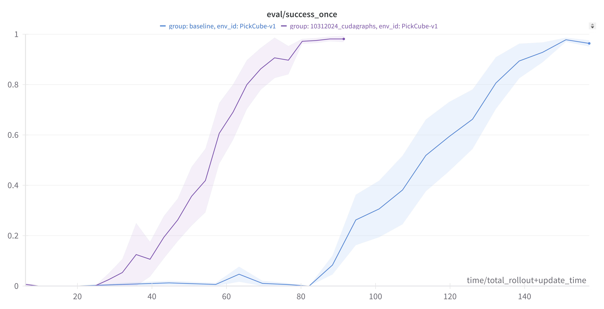

# RL Robotics Speedrun

Speed-running solving robot manipulation tasks in [ManiSkill](https://github.com/haosulab/ManiSkill). Goal is to simply solve a list of tasks as fast as possible with RL + fixed dense rewards starting from scratch.


Inspired by the [great speedrunning work done for LLMs by Jordan et. al](https://github.com/KellerJordan/modded-nanogpt)

## Getting Started

You can run the speedrun/benchmark via your local machine or [google colab](https://colab.research.google.com/github/StoneT2000/rl-robotics-speedrun/blob/main/rl_robotics_speedrun_colab.ipynb). To set up locally, we recommend using conda/mamba to manage dependencies:

```bash
conda create -n rl-robotics-speedrun python=3.11
conda activate rl-robotics-speedrun
git clone https://github.com/StoneT2000/rl-robotics-speedrun
cd rl-robotics-speedrun
pip install -e .
```

## Benchmarking 

To run the benchmark `cd` into one of the folders and run the script.sh file.

This by default logs results to tensorboard and wandb. You will need to setup a [wandb account](https://wandb.ai/). Wandb helps better display aggregated results. 

```bash
cd records/baseline && bash script.sh
```

The current standard is to run PPO initialized with random weights on 10 different seeds. By default this does not record evaluation videos. Remove `--no-capture_video` to record videos. Remove `--track` to not use wandb. Each of the 10 runs takes about 2 minutes to run on a 4090.

Current best is `records/10312024_cudagraphs` which is standard PPO + GPU Simulation, very few steps per environment during rollouts, and cudagraphs enabled based on [leanrl](https://github.com/pytorch-labs/LeanRL/). Achieves >= 95% success rate after ~80s


| Environment | Best Time | Wandb Results |
|------------|-----------|---------------|
| PickCube-v1 (state) | 80s | [Link](https://wandb.ai/stonet2000/PPO-ManiSkill-GPU-SpeedRun/workspace?nw=qgul0t4vstq) |
| PickCube-v1 (visual) | ~ | ~ |
| PushT-v1 (state) | ~ | ~ |
| PushT-v1 (visual) | ~ | ~ |

All results on 4090: [Wandb Link](https://wandb.ai/stonet2000/PPO-ManiSkill-GPU-SpeedRun/workspace?nw=qgul0t4vstq)

All results on L4 (Google Colab GPU): [Wandb Link](https://wandb.ai/stonet2000/PPO-ManiSkill-GPU-SpeedRun/workspace?nw=4y9yisg3h9e)


